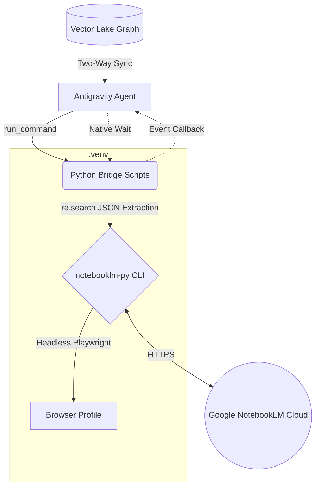

# Antigravity NotebookLM Plugin

[🌐 中文文档 (Chinese)](README_zh.md)

An enterprise-grade, event-driven integration of [Google's NotebookLM](https://notebooklm.google.com/) into the Antigravity multi-agent ecosystem. This plugin abstracts the complex web-scraping and browser orchestration of `notebooklm-py` into a strictly governed, asynchronous, and JSON-safe Agent Skill.

## 🏗️ Architecture

The plugin is designed around the **"Zero-SDK & Event-Driven"** philosophy, bridging the gap between Antigravity agents and Google's internal APIs safely.



## 🌟 Core Features

### 1. Fully Mapped Artifact Generation
The plugin dynamically supports generating all **9 official NotebookLM Artifacts** natively within the agent chat interface:
- 🎙️ **Audio Overview** (Podcast with custom instructions)
- 📽️ **Video Overview** (Video with custom instructions)
- 🎬 **Cinematic Video** (Hidden feature)
- 📊 **Slide Deck**
- 🧠 **Mind Map**
- 📑 **Reports**
- 📇 **Flashcards**
- 📝 **Quiz**
- 📈 **Infographic** & **Data Table**

### 2. Deep Knowledge Base Management
Total control over your specific Notebook sources:
- **Ask/Query**: Directly query the Notebook LM knowledge base for answers.
- **Source Management**: List, add, and physical deletion of specific source IDs to curate the corpus.
- **Deep Research**: Automatically search the web/drive and digest results.

### 3. Event-Driven Orchestration
NotebookLM generations take time. Instead of wasting tokens on polling loops, the agent utilizes native `wait` commands to suspend execution entirely. When the cloud generation finishes, the OS automatically wakes the agent up.

### 4. Toxic I/O Isolation (JSON Bridge)
The Bridge layer uses Regular Expressions to forcefully extract valid JSON payloads, completely discarding any random Playwright engine warnings or Chromium download logs that would otherwise crash the Agent's parser.

### 5. Rich Media & Vector Lake Sync
Raw `.wav` and `.mp4` downloads are automatically wrapped into `.md` Artifacts with absolute-path embeds, making Podcasts playable inside the UI. New notebooks are synced natively to the local `Vector Lake` graph.

## 📂 Directory Structure

```text
config/plugins/notebooklm/
├── plugin.json                 # Plugin metadata
├── README.md                   # English documentation
├── README_zh.md                # Chinese documentation
├── agents/
│   └── notebooklm_researcher/  # Dedicated subagent for long-running Deep Research
└── skills/
    └── notebooklm-core/
        ├── SKILL.md            # Execution Contract & Security Governance Gates
        └── scripts/            # The "Air-gapped" Python execution layer
            ├── .venv/          # Isolated Playwright environment
            ├── auth_bridge.py      
            ├── notebook_bridge.py  
            └── generate_bridge.py   
```

## 🚀 Setup & Authentication

Because NotebookLM relies on Google's internal APIs, it requires valid browser cookies. **The Agent is strictly forbidden from stealing cookies without explicit user consent.**

To initialize the plugin on a new host machine:

1. **Enter the Virtual Environment:**
   ```powershell
   cd ~/.gemini/config/plugins/notebooklm/skills/notebooklm-core/scripts
   .\.venv\Scripts\Activate.ps1
   ```
2. **Launch Interactive Login:**
   ```powershell
   notebooklm login
   ```
   *A Chromium browser will pop up. Login to your Google account.*

3. **Verify Auth Health (Agent-Side):**
   ```bash
   python auth_bridge.py check
   ```

## 🤖 Using the Plugin

Simply ask Antigravity:
> *"Help me create a new NotebookLM project about Quantum Physics, upload this wiki link, and generate a 2-person podcast."*

The Agent will automatically:
1. Validate Auth via the Bridge.
2. Create the Notebook & Link the Source.
3. Trigger the Podcast generation and natively `wait`.
4. Wake up, download the Audio, and serve it to you via a playable Markdown Artifact.
